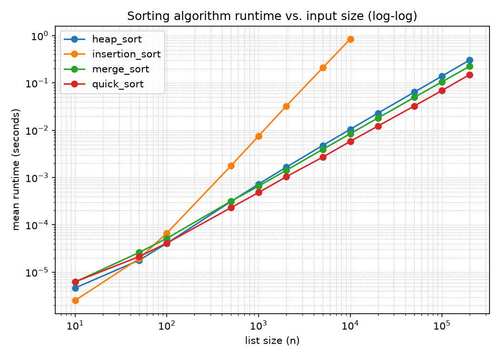

# Sorting algorithm benchmarking

Script: `src/sorting/benchmark.py`. Run it yourself with
`PYTHONPATH=src .venv/bin/python -m sorting.benchmark` from `assignment_04/`
(takes a couple of minutes). Raw data: `benchmark_data/results.csv` (one row
per trial), `benchmark_data/summary.csv` (mean/stdev per algorithm and size),
plot: `benchmark_data/runtime_vs_size.png`. The numbers below are from an
actual run on this machine, not estimated.

## Methodology

- **Lists:** random integers, generated with `random.Random(0)` (a fixed seed,
  so reruns are comparable instead of each being a one-off lucky or unlucky
  draw) via `rng.randint(0, upper)`, where `upper` scales with list size
  (`max(1000, size * 10)`) so large lists are not mostly duplicate values.
- **Sizes:** 10, 50, 100, 500, 1,000, 2,000, 5,000, 10,000, then 20,000,
  50,000, 100,000, 200,000 for the three Θ(n log n) algorithms. Stepping by
  roughly 2x to 5x across three orders of magnitude makes it possible to see
  the growth *rate*, not just a couple of absolute numbers.
- **Insertion sort is capped at n = 10,000.** It is Θ(n²); the next step
  (20,000) would take about 4x as long as the 10,000 step already does
  (~0.85s), and the step after that roughly 16x, which stops being a
  reasonable amount of time to wait for a data point that the first eight
  sizes already establish the trend for.
- **Trials:** 5 per (algorithm, size) pair, each on a freshly generated
  random list (not the same list resorted 5 times, which would just measure
  one list's particular quirks). `summary.csv` reports the mean and standard
  deviation across those 5. The standard deviations are small relative to the
  means (generally under 2%, see the raw CSV), which is what makes 5 trials
  enough here: these are deterministic algorithms doing consistent amounts of
  work on lists from the same size and distribution, not something like a
  network call with unpredictable latency spikes that would need many more
  trials to get a reliable mean.
- **Timing:** `time.perf_counter()` immediately before and after the call to
  the sort function only; list generation is not included in the timed
  region.

## Results

Both axes are log scale. On a log-log plot, a function that is Θ(n^k) is a
straight line with slope k, so insertion sort's visibly steeper line is the
picture of Θ(n²) against the other three's shallower, near-parallel Θ(n log n)
lines.

Selected numbers from `summary.csv` (seconds, mean of 5 trials):

| n | insertion_sort | merge_sort | quick_sort | heap_sort |
|---:|---:|---:|---:|---:|
| 1,000 | 0.00755 | 0.00066 | 0.00048 | 0.00073 |
| 10,000 | 0.84907 | 0.00845 | 0.00581 | 0.01047 |
| 100,000 | N/A (not run) | 0.10532 | 0.06918 | 0.13949 |
| 200,000 | N/A (not run) | 0.22516 | 0.14995 | 0.30463 |

## Conclusions

**Insertion sort's growth really is quadratic, not just "slower".** From
n = 5,000 (0.209s) to n = 10,000 (0.849s), doubling n multiplied the runtime
by 4.06x. That is exactly what Θ(n²) predicts (doubling n should roughly
quadruple n², i.e. 2² = 4), not a coincidence of these two particular data
points: the same roughly-4x-per-doubling pattern holds going from n = 2,000
to n = 5,000 and from n = 1,000 to n = 2,000 too.

**The three Θ(n log n) algorithms really do grow like n log n, not like n.**
From n = 100,000 to n = 200,000, merge sort's runtime went from 0.1053s to
0.2252s, a 2.14x increase. Pure linear growth would predict exactly 2x; the
extra bit matches n log n's prediction of 2 × (log 200,000 / log 100,000) ≈
2.12x almost exactly. Quick sort and heap sort show the same pattern in the
raw CSV.

**At n = 10,000, insertion sort is already about 100x to 180x slower than
any of the other three**, despite being in the lead at the very smallest
sizes (n = 10: insertion sort is the fastest of all four, and simplest). This
is the concrete version of what "Θ(n²) vs. Θ(n log n)" is supposed to mean: a
smaller constant factor lets the worse-scaling algorithm win on tiny inputs,
but the crossover happens fast, by n in the hundreds here, and the gap only
widens after that.

**Same Θ(n log n) class, real differences in practice.** At n = 200,000,
quick sort (0.150s) is about 1.5x faster than merge sort (0.225s) and 2x
faster than heap sort (0.305s), consistently across every size from 500
upward in the raw data, not just at the largest size. Θ notation does not
capture this because it hides constant factors, and those constants come
from real implementation differences discussed in
`docs/complexity_analysis.md`: heap sort's parent/child index jumps are less
cache-friendly than the other two's closer-to-sequential access, and merge
sort pays for its extra buffer allocations on every merge. Quick sort, with
the least per-comparison bookkeeping here, comes out ahead despite being the
only one of the three without a worst-case Θ(n log n) guarantee.

**Which algorithm to use, in which case:** for small lists (a few hundred
elements or fewer), insertion sort's simplicity and small constant make it a
perfectly reasonable choice, and it is the only one of the four that is
asymptotically faster on already-sorted or nearly-sorted input (Θ(n) best
case). Past that, prefer one of the Θ(n log n) algorithms: quick sort when
average-case speed matters most and the random-pivot mitigation in this
implementation is in place; merge sort when a stability or a guaranteed (not
just average) Θ(n log n) worst case matters and Θ(n) extra memory is
affordable; heap sort when a guaranteed Θ(n log n) worst case is needed but
memory is constrained to Θ(1) extra.
